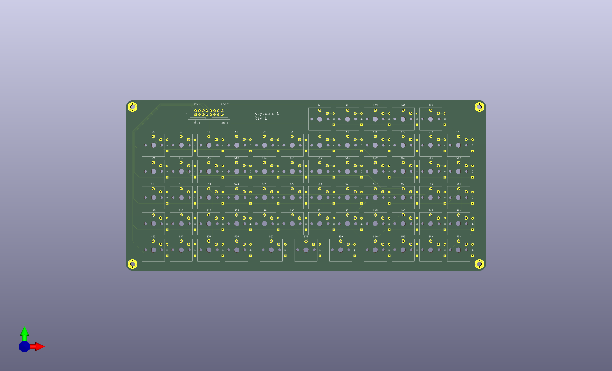

# Keyboard0
Basic Keyboard PCB

- 64 key orthogonal keyboard with Kaihl low-profile switches.

- The switches are logically arranged n 8x8 matrix but physically in 5 1/2 rows.

- There is no brain in the PCB, just a 2x8 header.

