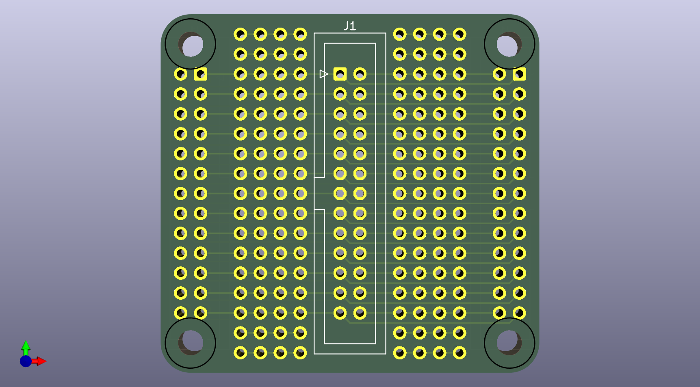

The feather board connects the keyboard matrix directly to gpio pins.  The feather/kb2040 module should be aligned with the header so 8 gpio pins connect to the keyboard matrix columns and 8 gpio pins connect to the keyboard matrix rows.  The board can be connected to the keyboard via cable or soldered
directly on the header.

